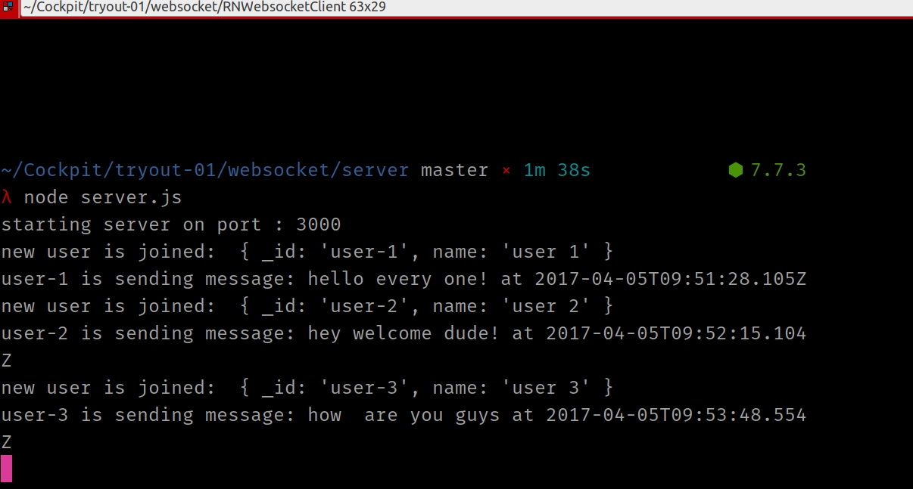
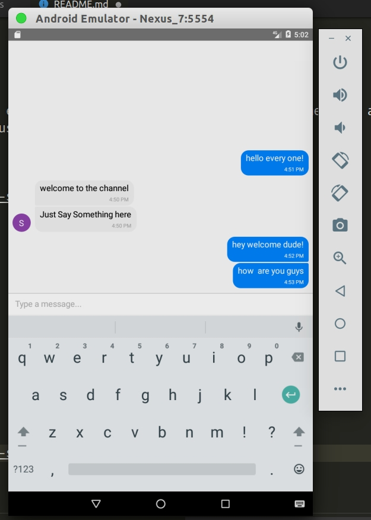
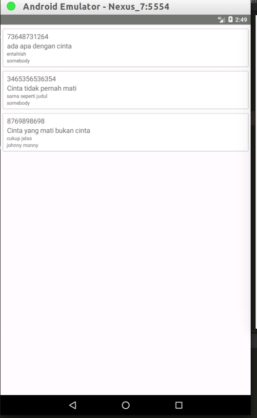

# Refactory - TRY OUT 01 
This repository contains source codes for Refactory's Try Out 01, which includes:
- Generator/Yield
- Websocket
- GraphQL

**Authored By: Erdiansyah**


## GENERATOR/ YIELD

This program will fetch its root directory list recursively

**How To Run**

```
cd yield
node index.js
```

## WEBSOCKET

### How To Run

**Server**


```
cd websocket/server
npm install
node server.js
```

The server will listen to every connected user, and display user message and broadcast the message to all connected user.

<p style="text-align:center">
    
</p>   


### The Client

**How To Run**

```
cd websocket/client
npm install
react-native start
react-native run-android
```
<p style="text-align:center">
    
</p> 


## GRAPHQL

### Data Schema

The schema for this project is about articles. It should contain title, content and author.
So this is the json schema that reflect this scenario:

```
article = {
    id: Int,
    title: String,
    content: String,
    author: String
}
``` 
### How To Run

**Server**

- in the terminal, change dir into graphql directory
    ```
        cd graphql
    ```
- run npm install
    ```
        npm install
    ```
- Run it! this project use babel to transpile ES6 code to ES5
don't directly run it via **node** command. so use npm start instead:  
    ```
        npm start
    ```

### Simulate Query and manipulate data from the server

**First hit url in the brwoser at url : 'http://localhost:4000/graphql'**

**Query List Of Article**

enter this query and press Execute Query 

```
{
            getArticles{
                id
                title
                content
                author
            }
}
```

**Get Article by ID**

enter this query and press Execute Query 

```
{
            getArticle(id: "the id")
}
```


**Create new Article**

enter this query and press Execute Query 

```
mutation
{
            createArticle(input: {title: "", content: "", author: ""})
}
```
**Update article by ID**

enter this query and press Execute Query 

```
mutation
{
            updateArticle(id: "", input: {title: "", content: "", author: ""})
}
```

### Client

**How To Run**


- remember to change the server constant in RNArticles/src/article-list.js.
change it base on your environement

- run the following command:

```
    cd RNArticles
    npm install
    react-native start
    react-native run-android
```

**ScreenShot**

The client will looked like this:

<p style="text-align:center">
    
</p>

## License

MIT

## Footnote

This repository is maintained by Erdiansyah. Get in touch with the author here [by email](erdiavartanovich@gmail.co) or via linkedin [here](http://linkedin.com/in/htwibowo)