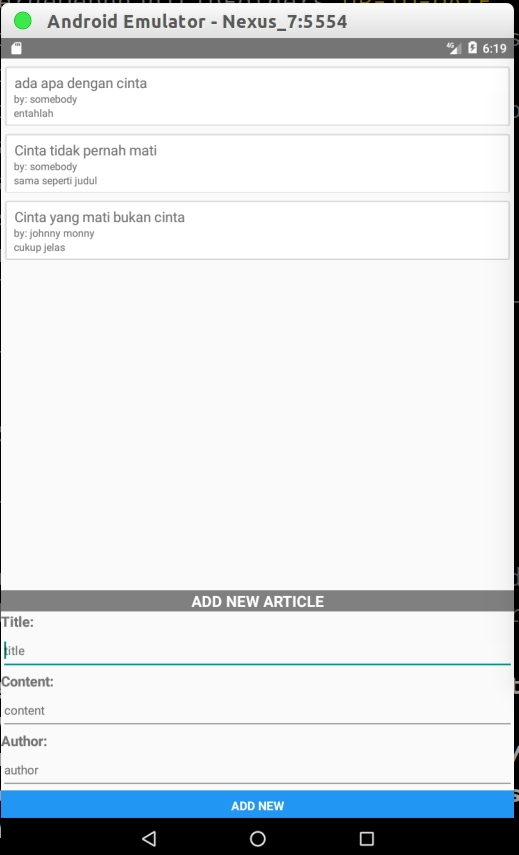

# TRY OUT 01 

- Author Name: Erdiansyah
- email: erdivartanovich@gmail.com
- Lisence: MIT


## READ DIRECTORY LIST ( USE GENERATOR YIELD)

This program will fetch its root directory list recursively

### HOW TO RUN

```
cd yield
node index.js
```

## WEBSOCKET

### The Server

#### HOW TO RUN

```
cd websocket/server
npm install
node server.js
```

The server will listen to every connected user, and display user message and broadcast the message to all connected user.

### Visualization


### The Client

#### HOW TO RUN

```
cd websocket/client
npm install
react-native start
react-native run-android
```

### Visualization


## GRAPHQL

### Data Schema

The schema for this project is about articles. It should contain title, content and author.
So this is the JSON schema that reflect this scenario:

```
article = {
    id: Int,
    title: String,
    content: String,
    author: String
}
``` 
### How to run the project

### Run the server

- in the terminal, change dir into graphql directory
    ```
        cd graphql
    ```
- run npm install
    ```
        npm install
    ```
- Run it! this project use babel to transpile ES6 code to ES5
don't directly run it via **node** command. so use npm start instead:  
    ```
        npm start
    ```

### Query and manipulate data from the server

First hit url in the brwoser at url : 'http://localhost:4000/graphql'

#### Query List Of Article

enter this query and press Execute Query 

```
{
            getArticles{
                id
                title
                content
                author
            }
}
```

#### Get Article by ID

enter this query and press Execute Query 

```
{
            getArticle(id: "the id")
}
```


### create new Article

enter this query and press Execute Query 

```
mutation
{
            createArticle(input: {title: "", content: "", author: ""})
}
```
### Update article by ID

enter this query and press Execute Query 

```
mutation
{
            updateArticle(id: "", input: {title: "", content: "", author: ""})
}
```

### Run the Client



remember to change the server constant in RNArticles/src/article-list.js.
change it base on your environement

```
    cd RNArticles
    npm install
    react-native start
    react-native run-android
```
